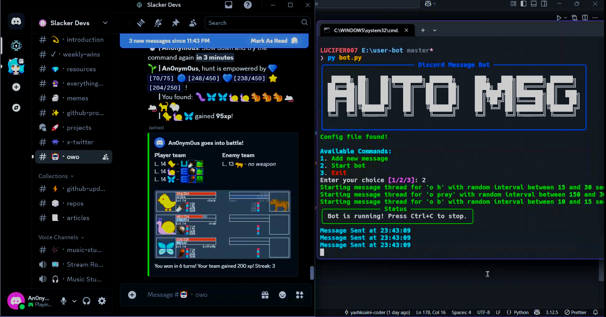
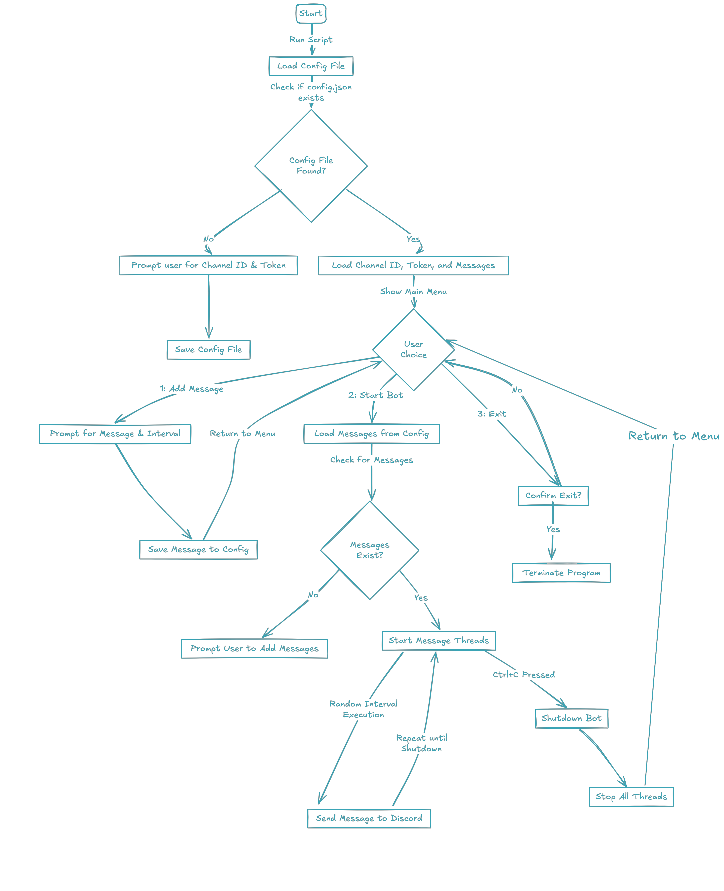

# Auto message 🤖 

An Automating python script to send message to a channel on behalf of a user with specific messages & their assigned intervals.

## Usage 🚀

1. Clone the repository:

```bash
git clone https://github.com/yashksaini-coder/auto-msg-discord
cd auto-msg-discord
```

2. Create and activate virtual environment:

```bash
python -m venv venv
source venv/bin/activate  # On Windows, use `venv\Scripts\activate`
```

3. Install dependencies:

```bash
pip install -r requirements.txt  # Or use `uv pip install` if available
```

4. Run the bot:

```bash
python bot.py
```

## 🎥 Video Demo

> Here's a working and expected screenshot of REPO_NAME

<div>
    <a href="https://www.youtube.com/watch?v=e_oeqp96lRc" target="_blank">
    
    </a>
</div>

<br>

## Configuration ⚙️

The configuration is done in the `config.json` file.

> Note: Make sure to configure `config.json` before running the bot.

```json
{
  "Config": [
    {
      "token": "your_token_here",
      "channel_id": "your_channel_id_here",
      "messages": [
        {
          "content": "Hello, this is a test message!",
          "min_interval": 5,
          "max_interval": 10
        },
        {
          "content": "This is another message.",
          "min_interval": 10,
          "max_interval": 15
        }
      ]
    }
  ]
}
```
## Configuration Fields
- `token`: Your user profile token. You can get it from the Authorization Headers in **_Chrome Tools Network_** tab.
- `channel_id`: The ID of the channel where you want to send messages. You can get it by right-clicking on the channel and selecting "Copy ID" (make sure Developer Mode is enabled in Discord settings).   
- `messages`: An array of message objects. Each object contains:
  - `content`: The message content to be sent.
  - `min_interval`: The minimum interval (in seconds) between messages.
  - `max_interval`: The maximum interval (in seconds) between messages.

## Workflow 🔄

- The bot will send messages to the specified channel at random intervals between the `min_interval` and `max_interval` for each message.
- The bot will continue to send messages until it is stopped manually.
- The bot will log the sent messages to the terminal console with proper timestamps.



## Developers 👨‍💻

<a href="https://github.com/yashksaini-coder">
    <table>
        <tbody>
            <tr>
                <td align="left" valign="top" width="14.28%">
                    
                    <br/>
                    <h4 align="center">
                        <b>Yash K. Saini</b>
                    </h4>
                    <div align="center">
                        <p>(Author)</p>
                    </div>
                </td>
                <td align="left" valign="top" width="85%">
                    <p>
                        👋 Hi there! I'm <u><em><strong>Yash K. Saini</strong></em></u>, a self-taught software developer and a computer science student from India.
                    </p>
                    <ul>
                     <li>
                        I love building & contributing to Open Source software solutions & projects that help solve real-world problems.
                    </li>
                    <li>
                        I want to build products & systems that can benefit & solve problems for many other DEVs.
                    </li>
                </td>
            </tr>
        </tbody>
    </table>
</a>

<div align="center">
    <p>
        <strong>Made with ☕</strong>
    </p>
</div>
